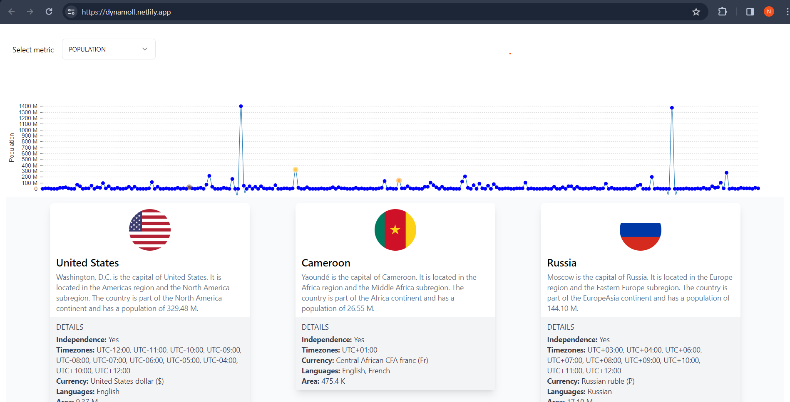

# Country Details Dashboard

This project is a dashboard that displays short details about countries using Nivo charts. It allows users to click on points in the chart to view country details below the chart. The dashboard also supports dragging and dropping cards representing countries. When a card is dragged and dropped, the corresponding country is selected, and clicking on the point again deselects it. Additionally, clicking on a country point changes its color, highlighting it for better visibility.



## Features

- Interactive Nivo chart displaying country data
- Clicking on a country point in the chart displays details about the country below the chart
- Drag-and-drop functionality for country cards
- Selected countries are stored in a stack and can be deselected by clicking on the point again
- Clicking on a point will highlight with different color of different country point it and show a card below the chart with the country's data.

## Technologies Used

- React.js for the frontend
- Nivo for charting
- Custom drag-and-drop functionality
- Typescript and Vite

## Live Demo

Check out the live demo [here](https://dynamofl.netlify.app/).


## Getting Started

To run the project locally, follow these steps:

1. Clone the repository:

   ```bash
   git clone https://github.com/NishantCoder108/chartify.git
   ```

2. Install dependencies:

   ```bash
   cd chartify
   npm install
   ```

3. Start the development server:

   ```bash
   npm run dev
   ```

4. Open your browser and navigate to `http://localhost:5173/` to view the app.


